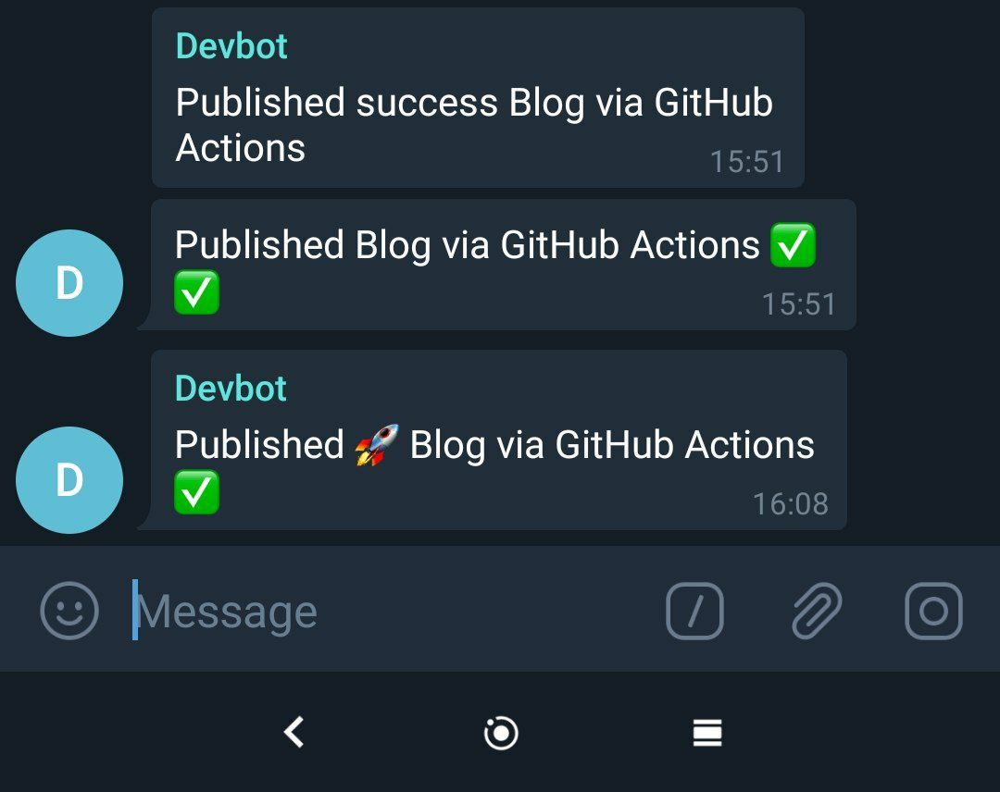

# Telegram Notification for Github action

<p align="center">
  <a href="https://telegram.org/"></a>
</p>

# [ Guide to create a bot and adding to telegram chat ](https://dev.to/rizkyrajitha/get-notifications-with-telegram-bot-537l)



### add TELEGRAM_BOT_ID and TELEGRAM_CHAT_ID to the secrets in github repo

Example

```

name: Telegram Notification


on:
  push:
    branches: [master]

jobs:
  Publish:
    runs-on: [ubuntu-latest]

    steps:
      - name: checkout master  branch # checkout master  branch
        uses: actions/checkout@v2
        with:
          persist-credentials: false

      - name: run yarn install and build # go to temp folder and run npm build to create files.
        run: |
          cd temp
          yarn install
          yarn build

      - name: Notify via TELEGRAM BOT
        uses: RizkyRajitha/github_actions_notify_telegram@v1
        with:
          TELEGRAM_BOT_ID: ${{ secrets.TELEGRAM_BOT_ID }}
          TELEGRAM_CHAT_ID: ${{ secrets.TELEGRAM_CHAT_ID }}
          CUSTOMMESSAGESUCCESS: "Published \xF0\x9F\x9A\x80 Blog via GitHub Actions"
          CUSTOMMESSAGESFAILURE: "Publishing  Blog \xE2\x9B\x94 via GitHub Actions Failed"
          CUSTOMMESSAGESCANCELLED: "Publishing  Blog \xE2\x9B\x94 via GitHub Actions Cancelled"
          JOBSTATUS: ${{ job.status }}
          GITHUB_RUN_NUMBER: ${{ github.run_number }}
          GITHUB_REPOSITORY: ${{ github.repository }}
          GITHUB_RUN_ID: ${{ github.run_id }}
          GITHUB_ACTOR: ${{ github.actor }}
          GITHUB_EVENT_NAME: ${{ github.event_name }}
          GITHUB_SHA: ${{ github.sha }}


```

# Create a JavaScript Action

<p align="center">
  <a href="https://github.com/RizkyRajitha/github_actions_notify_telegram/actions"></a>
</p>

Use this template to bootstrap the creation of a JavaScript action.:rocket:

This template includes tests, linting, a validation workflow, publishing, and versioning guidance.

If you are new, there's also a simpler introduction. See the [Hello World JavaScript Action](https://github.com/actions/hello-world-javascript-action)

## Create an action from this template

Click the `Use this Template` and provide the new repo details for your action

## Code in Main

Install the dependencies

```bash
npm install
```

Run the tests :heavy_check_mark:

```bash
$ npm test

 PASS  ./index.test.js
  ✓ throws invalid number (3ms)
  ✓ wait 500 ms (504ms)
  ✓ test runs (95ms)
...
```

## Change action.yml

The action.yml contains defines the inputs and output for your action.

Update the action.yml with your name, description, inputs and outputs for your action.

See the [documentation](https://help.github.com/en/articles/metadata-syntax-for-github-actions)

## Change the Code

Most toolkit and CI/CD operations involve async operations so the action is run in an async function.

```javascript
const core = require('@actions/core');
...

async function run() {
  try {
      ...
  }
  catch (error) {
    core.setFailed(error.message);
  }
}

run()
```

See the [toolkit documentation](https://github.com/actions/toolkit/blob/master/README.md#packages) for the various packages.

## Package for distribution

GitHub Actions will run the entry point from the action.yml. Packaging assembles the code into one file that can be checked in to Git, enabling fast and reliable execution and preventing the need to check in node_modules.

Actions are run from GitHub repos. Packaging the action will create a packaged action in the dist folder.

Run prepare

```bash
npm run prepare
```

Since the packaged index.js is run from the dist folder.

```bash
git add dist
```

## Create a release branch

Users shouldn't consume the action from master since that would be latest code and actions can break compatibility between major versions.

Checkin to the v1 release branch

```bash
git checkout -b v1
git commit -a -m "v1 release"
```

```bash
git push origin v1
```

Your action is now published! :rocket:

See the [versioning documentation](https://github.com/actions/toolkit/blob/master/docs/action-versioning.md)

## Usage

You can now consume the action by referencing the v1 branch

```yaml
uses: actions/javascript-action@v1
with:
  milliseconds: 1000
```

See the [actions tab](https://github.com/actions/javascript-action/actions) for runs of this action! :rocket:
